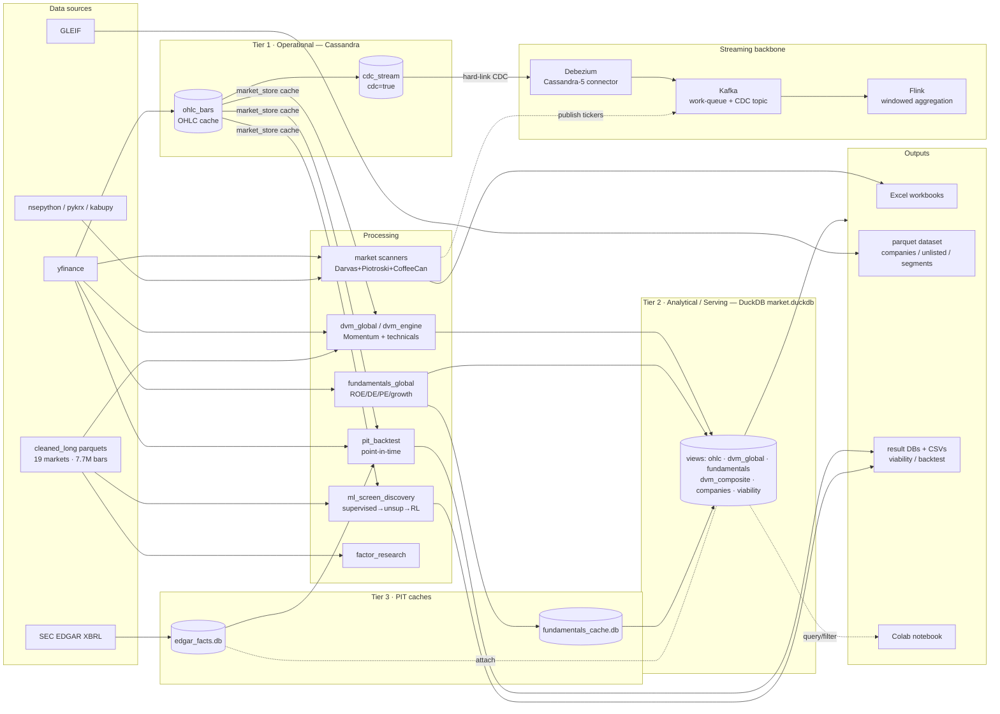
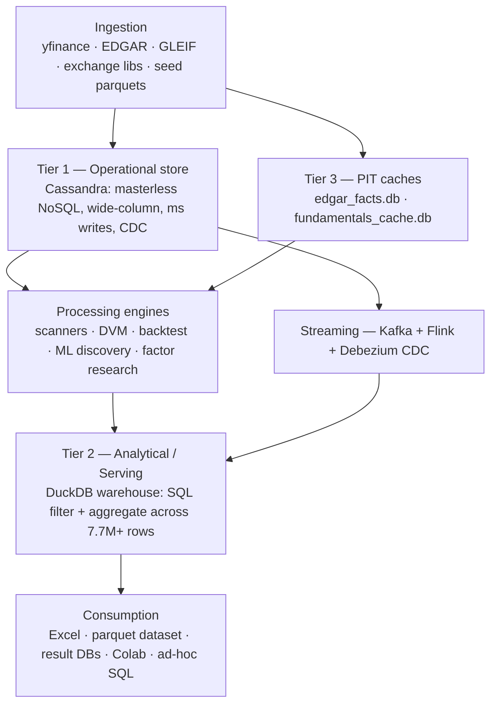
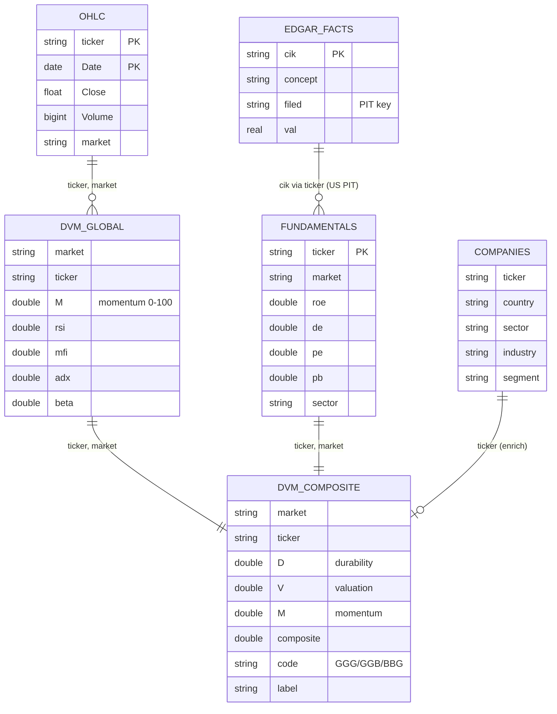

# Architecture Map

Visual map of the platform — data flow, tiers, and the analytical schema. Rendered
by GitHub (Mermaid). Companion to [ARCHITECTURE.md](ARCHITECTURE.md) (blueprint
mapping) and [SCHEMA.md](SCHEMA.md) (data dictionary).

## Data flow — sources → operational → analytical → outputs

## Tiered architecture (Modern Data Architecture Blueprint)

## Analytical schema (join model)

## Two-tier principle
- **Cassandra** (operational) — high-write OHLC cache + CDC, availability-first (AP/BASE).
- **DuckDB** (analytical/serving) — fast ad-hoc filtering/aggregation, the query surface.

Update = re-run any producer; the warehouse views reflect the live files with no ETL.
See [SCHEMA.md](SCHEMA.md) for full column-level detail.
